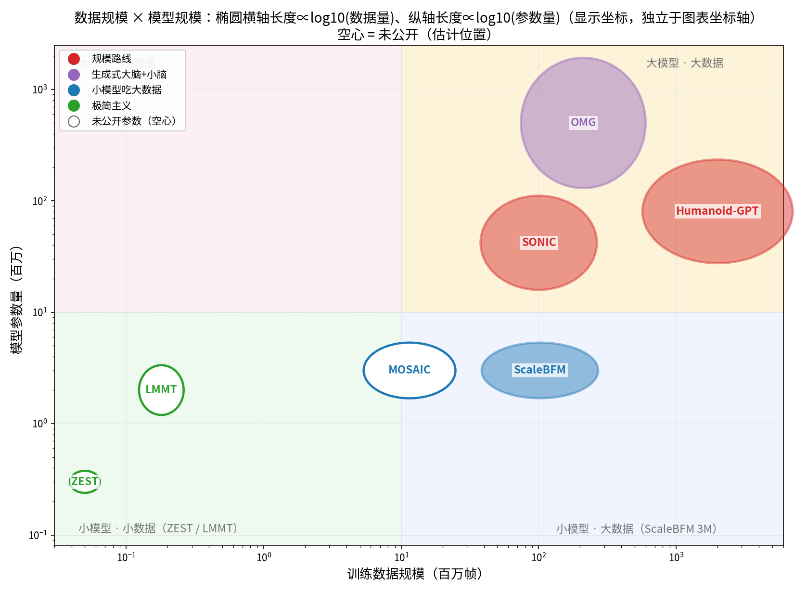
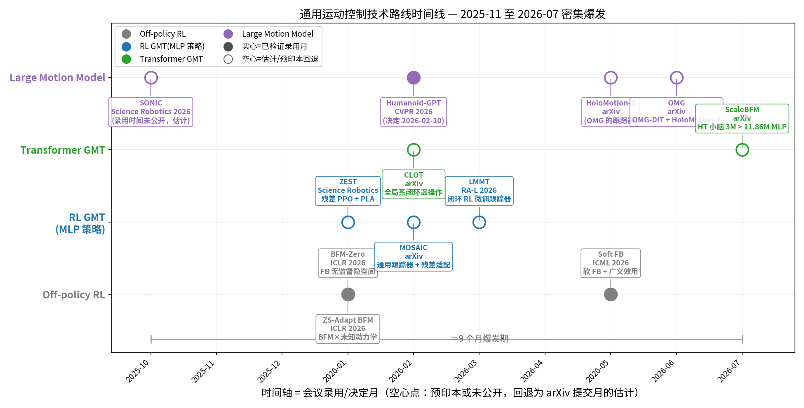

# 人形机器人动作跟踪与行为基础模型 —— 每工作三页幻灯片

每篇按 **① 问题与动机 → ② 方法与系统 → ③ 性能与贡献 → ④ 技术细节** 组织。数字取自 `/home/tcl/Documents/Temp/RoboticsControl/` 中的论文 PDF；技术页为基于论文方法部分的综合叙述。

---

# 第一部分 — SONIC（NVIDIA GEAR, Science Robotics 2026, arXiv 2511.07820）

## 幻灯片 1-1 — SONIC：问题与动机

# 超大规模动作跟踪，实现自然的人形全身控制

**问题：** 面向任务手工设计奖励函数的控制器脆弱、不自然、难以覆盖多任务。

**动机：**
- 强化学习的运动控制长期依赖逐任务奖励工程——换任务重写奖励、换机器人重调参数
- 动作跟踪（motion tracking）作为通用技能底座被反复验证，但此前规模受限（数据 <10M 帧级别）
- 核心假设：**自然性与鲁棒性不是设计出来的，是规模涌现的**——需要验证"超大规模数据 + 模型 + 算力"能否一次性解决运动+操作+遥操作

**验证载体：** Unitree G1 全身控制，覆盖行走、操纵、VR 遥操作、下游 VLA 任务

## 幻灯片 1-2 — SONIC：方法与系统

# 数据管线 + FSQ 分词器 + 大规模 RL 训练

**系统组成：**
- **数据**：100M 帧 / 611 小时 / 317K 段动作片段——从公开动捕（AMASS/LAFan 类）到自采遥操作，统一重定向到 G1
- **动作表示**：FSQ（有限标量量化）将任意模态指令离散化为统一 token（消融中比 VQ-VAE 好 8.7 mm），既是多模态汇合点也是 VLA 动作接口
- **训练**：大规模 on-policy RL（PPO 类），128 GPU × 7 天 = 21k GPU 时；策略 42M 参数（MLP 编码器-解码器，非 Transformer）
- **部署**：TensorRT 导出，Jetson Orin 上 1–2 ms / 50 Hz
- **动作空间即接口**：SONIC token 动作空间可直接作为下游 VLA（GR00T N1.5）的输出头

**核心设计哲学：** 不改算法，把每一轴（数据、模型、算力）同时拉满

## 幻灯片 1-3 — SONIC：性能与贡献

# 规模带来涌现：98.7% 成功率 + VLA +42 分

**性能：**
- 成功率 **98.7 / 99.6 / 97.0%**（测试内容/重复动作/PHUMA）vs BeyondMimic 81.6/85.8/73.4%（图 2d-g）
- MPJPE-L **23.2 mm** vs 39.1 mm（**−41%**）；实机 99.2% 成功率 / 25.7 mm（仿真 100%/22.3 mm，123 段实物序列）
- 速度跟踪存活率 **98.5% vs OpenHomie 43.0%**；至 ~4 m/s 接近 100% 存活
- 规模消融：数据 4M→100M 帧 → 98.0→99.6% 成功率、27.7→23.8 mm
- 下游 VLA（GR00T N1.5）：SONIC token 动作空间平均任务成功率 **68%**，SMPL 仅 27%（+42 分；长时程任务 60% vs 0%，表 3）

**贡献：** 确立动作跟踪为可扩展的基础任务；FSQ 分词器；"通用技能底座 + VLA 大脑"的两层栈

链接：[论文](https://arxiv.org/abs/2511.07820) · [项目](https://nvlabs.github.io/SONIC)

## 幻灯片 1-4 — SONIC：技术细节

# FSQ 分词 + MLP 编码器-解码器 + 大规模 PPO

**动作分词（FSQ，本身零参数——纯量化算子）：**
- 配置 **FSQ-32-32**：2 个 token，每个 32 维、每维 32 级；每维 `round((L−1)/2·(tanh(h)+1))` 独立取整，梯度经 straight-through 估计穿过取整直达编码器
- 隐式码本 = 格点网格（无需 VQ-VAE 的 codebook learning / EMA / commitment loss，不可能 codebook collapse）——SONIC 动作分布 33 大类 / 8447 子类，collapse 是现实威胁
- 消融（表 4）：FSQ 26.6 mm vs 容量对齐的多头 VQ-VAE 35.3 mm；**token 维度比量化级数更重要**（16-32 优于 32-16）——表示容量 > 量化粒度
- 跟踪器以 token（而非连续参考帧）为条件——天然抗噪、可直接复用为 VLA 的动作头（预测 78 维 token 空间 vs 81 维 SMPL 连续位姿：68% vs 27%）

**策略与训练（Table S1，全部 MLP，无 Transformer）：**
- 编码器（g1/teleop/smpl 三种指令模态）均为 MLP `[2048,1024,512,512]`，映射到共享隐空间后经 FSQ 量化为统一 token
- 动作解码器 = MLP `[4096,4096,2048,2048,1024,1024,512,512]`，输出对角高斯（29 维动作）；Critic 同结构——42M 参数主要来自这两块深 MLP
- 快慢分层：**跟踪策略（50 Hz）全 MLP；Transformer 住在上游 10 Hz 规划层**做 token 补全——与 Humanoid-GPT"策略自己做 next-token 预测"形成两种拆法对照（HGPT 把序列建模放进策略，SONIC 外包给慢层，延迟预算是决定因素）
- 训练目标：PPO + 跟踪奖励（Table S3），on-policy 大 batch
- 仿真：GPU 并行物理（IsaacLab），128 GPU × 7 天；域随机化（摩擦/恢复系数/初始关节/基座质心 + 根速度扰动 + 指令扰动，Table S4）
- 部署：TensorRT + CUDA Graph，Jetson Orin 1–2 ms / 50 Hz，200 Hz 底层 PD；多速率架构四环：策略 50 Hz、指令流 500 Hz、操作员输入 100 Hz、运动学规划 10 Hz

**生成式运动学规划器（10 Hz 慢层，Sec 3.3）：**
- 任务 = FSQ token 空间的**运动补全（inbetweening）**：动作下采样 4 倍编码为 token 序列，条件仅两个关键帧——起始帧（历史状态）+ 目标帧（弹簧模型从用户速度指令外推 ~1 s）；训练采样 0.8–2.4 s 段
- 骨干 = **Transformer，MaskGIT 式掩码 token 迭代预测**：首轮全部以可学习 mask embedding 填充，每轮 softmax 出各位置分布后只"敲定"置信度最高的子集（余弦调度 `1−cos(πL/2L_max)`），训练掩码比例 [100%,0%] 均匀采样；GENMO 血统
- 运行时：自回归滚动，每步生成 ≤64 帧 @30 fps 的未来参考，重规划最高 10 Hz，上下文 4 帧 + 操作员指令；新旧轨迹 8 帧（160 ms）交叉淡化，SLERP 上采样到 50 Hz
- 延迟：笔记本 <5 ms、Orin ~12 ms；多模态（文本/音乐/视频）经外部扩散模型 GEM → human 编码器 ℰ_h 进同一 token 空间
- **参数量：规划器未披露**（仅定性"large-scale、与策略同数据训练"）；策略消融三档 1.2/16/42M，实机部署 42M（动作解码器 [4096,...,512] 深 MLP 为参数主体，critic 不计入部署模型）

**数据管线：** 多源动捕（AMASS/LAFan 类 + 自采遥操作）→ 统一重定向到 G1 骨架 → 清洗/分段 → 317K 段 / 611 h

---

# 第二部分 — Humanoid-GPT（CVPR 2026, arXiv 2606.03985）

## 幻灯片 2-1 — Humanoid-GPT：问题与动机

# 扩展数据与结构实现零样本动作跟踪

**问题：** 跟踪策略对训练分布外的动作泛化差——换一段新舞就得重训或微调。

**动机：**
- 传统跟踪器（MLP/TCN）以"跟踪窗口 → 关节目标"的回归范式训练，对未见动作记忆而非泛化
- 大语言模型的启示：**规模 + 生成式（因果）结构**才带来零样本泛化——机器人控制能否复刻这条路？
- 关键瓶颈是数据：此前跟踪器训练集 <10M 帧，远不够"涌现"

**目标：** 单一模型，任意未见动作零样本跟踪（zero-shot tracking），且延迟满足 50 Hz 实机控制

## 幻灯片 2-2 — Humanoid-GPT：方法与系统

# GPT 配方迁移到机器人控制

**方法（三阶段，Fig. 2）：**
- **(a) 数据策展**：2B 帧 G1 重定向语料（AMASS + MotionX++ + MotionMillion + 自采），过滤坐椅/游泳/爬梯等含物体交互序列，变速时间增强
- **(b) 动作专家**：**HME（谐波运动嵌入）**度量动作多样性并聚类，每簇训练一个 PPO 专家（~300 个），关键点级奖励；聚类数消融 C ∈ {128…1024}
- **(c) 并行 DAgger 蒸馏**：全部专家蒸馏进单一因果 Transformer——一次前向、全部输出位置同时被教师历史监督（SmoothL1），这是选 Transformer 的结构理由（并行训练优势）
- **核心洞察：多样性与均衡性缺一不可**——长尾稀有动作会被常见风格淹没，需分布均衡采样
- **部署**：TensorRT + KV 缓存，端到端 <1.5 ms（推理核 0.92 ms），50 Hz 回路

**关键洞察：** 跟踪任务本身就是完美的自监督预训练目标——参考即标签，无需人工标注

## 幻灯片 2-3 — Humanoid-GPT：性能与贡献

# 92.6% 零样本成功率 + 清晰的数据/结构扩展律

**性能：**
- GPT-L：未见 AMASS 测试集 **92.58% 成功率、0.0735 rad MPJPE** vs 最优 TCN 89.05%；MPKPE **41.0 vs 56.2 mm**（−27%）（表 2）
- 数据扩展（2M→20M→200M→2B 帧）：零样本 MPJPE **0.166→0.128→0.105→0.094**（图 7）
- 结构扩展：MLP 76.9% < TCN 81.5% < GPT-S 83.3% < GPT-B 88.3% < GPT-L 92.6%
- 实机（G1、4 段未见舞蹈）：3/4 段胜过 GMT / TWIST / Any2Track（MPJPE 0.086–0.104 rad）（表 3）

**贡献：** 首次把 GPT 的"数据 × 结构"扩展律完整复刻到机器人跟踪；生成式跟踪范式；零样本实机验证

链接：[论文](https://arxiv.org/abs/2606.03985) · [代码](https://github.com/GalaxyGeneralRobotics/Humanoid-GPT)

## 幻灯片 2-4 — Humanoid-GPT：技术细节

# 因果 Transformer + 三阶段管线（策展 → PPO 专家 → 并行 DAgger 蒸馏）

**网络结构（Table 2 规模阶梯）：**
- 因果（单向）注意力 Transformer：GPT-S **5.7M** / GPT-B **22.1M** / GPT-L **80.4M**；基线 MLP(3层) 仅 0.25M、TCN(8层) 0.65M——结构差距与参数差距同向
- **输入 token** e_t = 拼接(当前本体感觉 s_t, 参考位姿 q_ref_t)；长度 H 的历史序列 {e_{t−H+1}…e_t} 进 Transformer，输出 = 各时刻全身动作（PD 目标），**所有输出位置一次性监督**（式 2）
- 跟踪天生因果（测试时看不到未来观测）——因果注意力是约束而非选择；对照 HumanPlus 的 Transformer+标准 PPO 路线放弃了并行优势

**训练流程（三阶段）：**
1. **数据策展**：2B 帧重定向（AMASS/MotionX++/MotionMillion/自采），过滤物体交互序列，变速增强
2. **PPO 专家**（~12k GPU 时）：HME 谐波嵌入聚类（~300 簇，消融 128–1024）→ 每簇一个专家；奖励为关键点级 R_kpt = R_pos + R_rot + R_vel + R_penalty（exp 加权关键点距离），规模化后重调了奖励分量
3. **并行 DAgger 蒸馏**（~3k GPU 时，合计 15k）：专家标注 roll out 的每个状态，Transformer 以 SmoothL1 拟合全部时间步——一次前向等于 H 步监督，这是相对逐帧 BC/RL 的效率来源

**部署延迟链（C.3）**：CPU 7.48 → ONNX 6.04 → GPU 5.29 → ONNX 4.36 → TensorRT+缓存 **0.92** → C++ 0.65 ms + 通信 0.39 ms——因果注意力 + KV 缓存把 <1.5 ms 的 50 Hz 预算做实；50 Hz 闭环含传感读取、推理、PD 计算、执行下发

---

# 第三部分 — MOSAIC（BAAI, arXiv 2602.08594）

## 幻灯片 3-1 — MOSAIC：问题与动机

# 通过快速残差适配弥合仿真到实物的鸿沟

**问题：** 仿真训练的通用跟踪器上实机后性能退化；逐机器人微调慢且灾难性遗忘。

**动机：**
- 仿真→实物差距（动力学误差、延迟、传感噪声）使 sim-trained 策略实机表现打折
- 标准答案"实机微调"有两宗罪：**数据贵**（需数小时实机交互）+ **遗忘**（微调后仿真 OOD 能力崩塌）
- 全栈开源的缺失：多数工作只开源策略，遥操作/数据/适配管线闭门造车

**目标：** 用**分钟级**实机数据恢复实机跟踪质量，同时不损失通用性

## 幻灯片 3-2 — MOSAIC：方法与系统

# 全栈开源系统 + 残差适配器

**系统组成：**
- **基础跟踪器 π_GMT**：多源动作库（公开语料 51 h + 惯性动捕 7 h + GENMO 生成 2.2 h，Table I）上的 PPO/MLP，奖励显式强调**世界系运动一致性**（遥操作的关键——自我中心跟踪在长时程下漂移）；BeyondMimic 式自适应重采样处理异质数据
- **残差适配（核心创新）**：先在 15–30 分钟遥操作数据上 RL 训练一个**适配教师 π_ADAPT**，再把 π_GMT（通用域）与 π_ADAPT（遥操作域）按动作域加权**多教师蒸馏**进残差模块 π_RES——最终 π_S = π_GMT + π_RES，主干全程冻结
- **多接口遥操作**：PICO VR（5 追踪带 + 2 手柄，延迟 ~0.4 s）/ 17 点惯性动捕（~0.2 s）；在线遥操作经 GMR 式重定向到机器人空间
- **RobotBridge**：模块化部署框架——策略检查点、参考动作、仿真器/机器人后端、低层控制器解耦，跨平台复用

## 幻灯片 3-3 — MOSAIC：性能与贡献

# 30 分钟数据 → 实机误差 −59%，且不遗忘

**性能：**
- 实机 VR 遥操作（表 V，~0.4 s 端到端延迟）：基础 EAP 2.94 m/100% → **Adapter(W) 1.19 m/100%（−59%）**；对比微调 1.41 m 但仅 92% 成功、持续学习 1.72 m/100%
- 适配数据量效应（表 VI）：3/15/30 分钟 → EAP 2.83/1.57/**1.19** m（15 分钟起收益显现）
- 遗忘对比（表 IV，Motion-X-Sub OOD）：微调使成功率 **77.9→40.6% 崩塌**（EAP 0.82→2.76 m）；Adapter 77.3%/0.82 m（几乎无损）；持续学习 78.4% 但实机差
- FLD 数据增强（3 分钟→合成 10 h）：EAP 仅 2.93 m，**边际收益**——接口级适配 > 扩周期性数据

**贡献：** 分钟级残差适配范式；世界系奖励的遥操作导向跟踪；全开源全栈系统（RobotBridge + 跟踪 + 多接口遥操作 + 适配管线）

链接：[论文](https://arxiv.org/abs/2602.08594) · [代码](https://github.com/BAAI-Humanoid/MOSAIC)

## 幻灯片 3-4 — MOSAIC：技术细节

# 多教师蒸馏残差：π_S = π_GMT + π_RES（冻结主干）

**残差机制（式 2–3）：**
- **π_S(o_t) = π_GMT(o_t) + π_RES(o_t)**——加性动作修正，π_GMT 全程冻结
- π_RES = 轻量 MLP **[512, 256, 128] + 线性输出层**（ELU），输入与主干相同的部署侧观测；输出 29 维 Δa
- **零偏置初始化**（沿用 ResMimic）：末层近零权重增益 + 零偏置——初始残差 ≈ 0，训练早期保守更新，不破坏主干行为
- **训练路径不是直接 RL**：先 RL 训练适配教师 π_ADAPT（15–30 分钟遥操作数据）→ 多教师蒸馏 L = Σ w_k·‖π_S − π^(k)‖²，π_GMT 教通用域、π_ADAPT 教遥操作域，按 rollout 的动作域加权（MSE，式 3）
- **Adapter(W)/(R) 的真实含义**：适配教师训练时的**奖励参照系**——世界系（World-frame，遥操作目标所在）vs 机器人系（Robot-frame）；W 在实机 VR 上最好（1.19 vs 1.53 m），两者在 OOD 上几乎相同
- **三种适配策略对照**：微调 = 只在新数据上继续训（OOD 崩 77.9→40.6% + 过拟合致成功率 92%）；持续学习 = 新数据混原始 ~60 h 语料回放（保 OOD 78.4% 但实机仅 1.72 m——30 分钟新数据占比 <1%，**梯度稀释**学不动）；残差蒸馏 = 主干冻结严格无损 + 残差模块上新数据梯度占比 100%——唯一不败

**基础跟踪器训练：**
- MLP actor-critic 隐层 **[1024, 1024, 512, 256]**（ELU），PPO（rsl-rl），IsaacLab，8×A100 × 48 h，每 GPU 30K 并行环境
- 非对称 AC：actor 吃 5 步高斯噪声污染的本体感觉历史，critic 吃无噪特权状态
- 奖励强调**世界系跟踪**（全局锚点/身体/末端位置速度误差 E_AP/E_BP/E_EP）——自我中心跟踪在长时程遥操作下漂移，这是与多数 GMT 工作的关键差异
- 数据（Table I）：公开语料 51 h + 惯性动捕 7 h + GENMO 生成 2.2 h + 适配采集 1.0 h；BeyondMimic 式两级自适应重采样（动作级 + 段内失败率分箱）

**评测协议：**
- 仿真基准：MuJoCo，Motion-X 在线视频子集（OOD）；实机：VR 10 分钟保留测试集
- 结论三元组：微调（准但遗忘+不稳）< 持续学习（不遗忘但实机差）< 残差蒸馏（两边都要）

---

# 第四部分 — ZEST（Boston Dynamics / MIT, Science Robotics, arXiv 2602.00401）

## 幻灯片 4-1 — ZEST：问题与动机

# 零样本具身技能迁移，实现竞技级机器人控制

**问题：** 竞技技能（倒立、侧手翻、空翻）历来依赖逐技能的专家建模 + 奖励工程 + 迭代打磨。

**动机：**
- 竞技技能是机器人控制的"天花板"测试：高动态、接触丰富、毫秒级误差放大
- 规模路线（SONIC/HGPT 式大数据）之外还有另一条路：**不靠规模，靠模仿设计的精细化**——用普通动捕/甚至手机视频就能产出技能
- Atlas/Spot/G1 三平台验证：方法是否与机器人形态解耦？

**目标：** 单一模仿框架，从普通参考（动捕或视频）零样本（无实机微调）产出广谱竞技技能

## 幻灯片 4-2 — ZEST：方法与系统

# 模仿设计的极简主义：每技能 10 小时 × 单张 L4

**方法（极简观测 + 极简输出）：**
- **统一模仿框架**：三类数据源（高保真 MoCap / 噪声单目视频 ViCap / 无物理约束的动画数据）→ 同一套 RL 跟踪，**无接触标签、无参考/观测窗口、无状态估计器、无逐技能奖励工程**
- **观测极简**：仅 **下一步参考 + 当前本体感觉**，历史只有**上一步动作**——刻意避免多步参考窗口（消融证明反而阻碍收敛，见 4-4）
- **输出残差关节目标**：策略输出加到参考关节角上 → 关节级 PD——策略只需修正参考，不需从零生成全身姿态
- **自适应采样 + 自动课程**：训练采样偏向难片段（分箱失败率 EMA）；基于模型的**辅助力/力矩螺旋**（assistive wrench）按失败率自动退火至零，替代手工课程
- **跨平台**：Atlas、G1、Spot 同一框架（仅换执行器参数），约 20 项技能
- **训练成本极低**：约 **10 小时 / ~7k 迭代 / 单张 L4 GPU**，Isaac Lab，4096 并行环境（对比 SONIC 的 21k GPU 时）

**关键设计：** 把工程精力花在物理一致性（PD 增益、辅助力学模型、采样策略）上，而不是堆数据或堆观测

## 幻灯片 4-3 — ZEST：性能与贡献

# 约 20 项竞技技能零样本上实机，碾压 MPC

**性能：**
- 实机跟踪误差（MAE(q)）：行走 0.057 rad、慢跑 0.041、侧手翻 0.078–0.084、地板舞 0.079、匍匐 0.103、乒乓球对打 **29.98 秒** @ 0.108
- ViCap 技能：跳上箱 0.041、芭蕾 0.061、爬箱 0.073–0.108
- vs MPC（Atlas，表 2）：侧手翻 **0.088 vs 0.237**、慢跑 0.076 vs 0.117；MPC 在倒立、滚翻、舞蹈上**完全失败**
- 鲁棒性：爬箱连续 5/5；2 kg 负载；0.75 m 训练箱泛化至 0.55/0.95 m
- 里程碑：Spot 三周空翻（triple backflip）

**贡献：** 证明精心设计的模仿可替代规模；视频→技能的当日工作流；竞技技能的统一框架

链接：[论文](https://www.science.org/doi/10.1126/scirobotics.aec7695)

## 幻灯片 4-4 — ZEST：技术细节

# 模仿精细化：极简观测 + 残差输出 + 力学课程

**网络与训练（表 S7）：**
- 非对称 actor-critic：actor MLP **[512, 256, 128]**、critic MLP **[512, 512, 256]**，ELU 激活；经验式 running normalization
- PPO：lr 1e-3（自适应 KL，目标 0.01）、discount 0.99、GAE 0.95、clip 0.2、entropy 0.001；4096 环境，批 ~245K 样本，~10 h / ~7k 迭代 / 单张 L4，Isaac Lab

**辅助力螺旋课程（自动退火）：**
- 对基座施加模型计算的辅助力/力矩：PD 项跟踪基座姿态误差 + 前馈项补偿名义躯干动力学
- 增益 β∈(0, **β_max=0.60**) 部分支撑而非全托——高失败率分箱初始辅助更强、退火更激进；达标后辅助**衰减至零**，无需手工课程
- 奖励含 joint tracking + 生存奖励（每步常数正项，抑制过早终止）；早停条件：接触力超限、偏离参考过大、关节加速度/位置/力矩超限

**自适应采样（RSI 分箱）：**
- 按（动作 i，分箱 b）维护失败率，EMA 更新（α=0.005）；按失败率 logit/温度 τ 做 softmax 采样，带均匀下限 ε=0.15
- 长度归一化相似度 s̄_e 用 joint tracking 奖励计算——早停自动被"缺失步数"惩罚

**PLA（平行连杆执行器）建模 + PD 增益解析整定（Fig. 4，三级简化）：**
- 闭链机构（如大腿电机经四连杆驱动膝关节）产生**非对角电枢矩阵**，标准仿真器只支持对角——直接仿真欠准
- 三级渐进简化：① 精确模型（完整闭链动力学）→ ② 局部投影模型（支撑连杆无质量）→ ③ 动态电枢模型（Jacobi 近似耦合关节，仅引入轻微瞬态误差）→ ④ 名义电枢模型（单一名义构型算一次并固定，免去每步更新 ~20% 的开销）
- PD 增益由电枢解析值直接导出：**Kp = Iωn²、Kd = 2Iωn**——闭链执行器没有直接的关节电机模型也能定增益
- Spot 案例：原执行器模型够用一般技能，但**三周连跳后空翻不行**——补入功率限制算法、电机磁饱和、传动效率/摩擦等非线性后才弥合 sim-to-real（"refined actuator model"）

**负结果（消融）：**
- **多步未来参考窗口（0.4 s）在同等预算下阻碍收敛**——观测维度膨胀 > 信息增益，验证"下一步参考就够了"的极简主义
- 去掉课程仍能收敛但 20 h 性能仅及本方法在更早时点的水平；去掉自适应采样鲁棒性下降

**域随机化：** 脉冲推力、传感器噪声、摩擦系数与质量变化——零样本迁移实机

---

# 第五部分 — LMMT（RAL 2026, arXiv 2604.17335）

## 幻灯片 5-1 — LMMT：问题与动机

# 动作生成 + 动作跟踪实现全身移动

**问题：** 奖励塑形 RL 的步态下肢主导、上身僵硬；固定参考片段遇到意外地形就失效。

**动机：**
- 固定参考的根本缺陷：参考是**回放**的，不能对"眼前 80 cm 箱子"或"25 cm 台阶"做出反应
- 两难：奖励 RL 适应地形但步态丑；跟踪式步态美但不会变通
- 算力约束：一切要**机载**实时运行（G1 的 Thor + Orin），生成模型必须极快

**目标：** 让参考本身在线重新生成——感知到什么地形，就生成什么动作

## 幻灯片 5-2 — LMMT：方法与系统

# 扩散生成器（Thor）+ 跟踪器（Orin）双芯片机载

**系统组成（三阶段训练）：**
- **阶段 ① 数据构建**：原始视频经 **GVHMR** 重建人体动作 → 接触约束 IK 重定向到 G1；再用 DeepMimic 式跟踪策略精修轨迹 + 动作增强 → 共约 **1 小时**训练数据
- **阶段 ② 预训练**：扩散生成器（**MDM 架构**）与 RL 跟踪器（PPO, IsaacLab, 单张 RTX 4090）分别在离线数据上独立训练
- **阶段 ③ 闭环 RL 微调**：**冻结生成器**，跟踪器在随机化方向指令 + 更难地形上继续 RL——跟踪器学会容忍生成参考的瑕疵，实际充当**动作滤波器（motion filter）**
- **极速扩散**：仅 **2 步去噪**、TensorRT 部署后 **0.02 s** 生成 0.5 s（25 帧）全身参考；部署时每 **0.25 s** 滚动时域重规划
- **完全机载**：生成器跑 Jetson Thor（背负），跟踪器跑 G1 内置 Orin；LiDAR（Livox MID360）+ IMU 用 **DLIO** 估计基座位姿，**Elevation Mapping CuPy** 建地形高程图

**关键设计：** 生成器不是"大脑"而是感知→控制的**接口**——把地形决策翻译成跟踪器能执行的全身参考；闭环条件是**机器人过去两帧真实状态**（非自回归吃自己的预测）

## 幻灯片 5-3 — LMMT：性能与贡献

# 在线生成让地形成功率 0.23 → 0.96

**性能：**
- 地形成功率（每格 500 次试验，仅跟踪器 → +生成器）：
  - 箱子 **0.859→0.987**（80 cm 箱：**0.230→0.962**）
  - 跨越 **0.805→0.990**；楼梯 **0.845→0.997**（25 cm 台阶：0.114→0.986）（表 III）
- 实机演示（无计数试验）：75 cm 箱攀爬 + 跳下（3 种变体）、楼梯、连续跨越、局部导航——全部机载

**贡献：** 在线地形感知动作生成作为感知→控制接口；参考按情境重生成而非回放；双芯片全机载全身移动

链接：[论文](https://arxiv.org/abs/2604.17335)

## 幻灯片 5-4 — LMMT：技术细节

# MDM 扩散生成器 + 闭环条件 + RL 微调滤波

**生成器（MDM 架构扩散模型）：**
- 输出 0.5 s 时域（25 帧 @ 50 Hz）全身动作特征：根位置 R³ + 根朝向 R⁴ + 关节位置 R²³ + 身体连杆位置 R²³ˣ³
- 条件 = **目标朝向向量 + 地形高程扫描 + 过去两帧动作特征**；闭环方式 = 条件于**机器人真实过去状态**，而非自回归吃自己的预测——漂移不累积
- 极速推理：**2 步去噪 + TensorRT = 0.02 s**；训练 0.5 s 时域，部署 **0.25 s 滚动重规划**提升响应性
- 鲁棒化：训练/部署时向**生成器推理过程注入噪声**——下游跟踪器因此对劣质参考天然容忍

**跟踪器（PPO, IsaacLab, 单张 RTX 4090）：**
- 观测 = 参考状态 + 本体感觉（5 帧基座角速度、投影重力 R³、关节位置/速度 R²³、上一步动作 R²³）+ **地形高程扫描 R¹⁷ˣ¹¹**
- 输出 **23 维目标关节位置**（G1 23-DOF 变体）→ 关节 PD
- 预训练奖励 R_pre = 模仿奖励 + 正则项（表 I）；微调阶段加入**朝向跟踪任务奖励** r_task，随机化目标朝向
- 微调后跟踪器 = **动作滤波器**：跟踪生成模式的同时用地形观测抑制不安全行为

**实机感知链路：**
- Livox MID360 LiDAR + IMU → **DLIO** 位姿估计 → **Elevation Mapping CuPy** 高程图 → 生成器条件
- 头部运动干扰基座位姿估计：LiDAR-IMU 与躯干 IMU 融合（DLIO 朝向减去躯干 IMU 滑动平均俯仰）补偿头部俯仰变化
- 局限：依赖 LiDAR 高程图质量，感知噪声大时性能明显退化（作者点名 neural mapping / belief encoder 为后续方向）

---

# 第六部分 — OMG（清华 MARS + CMU, arXiv 2606.10340）

## 幻灯片 6-1 — OMG：问题与动机

# 全模态动作生成驱动通用型人形控制

**问题：** 每种意图模态（文本/语音/视频/VR/导航）历史上各自需要一套专用控制栈。

**动机：**
- "指令→动作"的模态碎片化：文本驱动一套、语音一套、VR 又一套——无法复用
- 人类动作生成模型（文生动作等）已很强，但与机器人控制脱节——生成的动作机器人跟不上（摔倒率高）
- 缺一个统一的大规模多模态动作数据集把所有模态拉到同一表示下

**目标：** 一个生成器吃任意模态意图，一个跟踪器执行——"任意意图 → 动作 → 控制"

## 幻灯片 6-2 — OMG：方法与系统

# 大脑/小脑通用栈 + 全模态语料

**系统组成（生成-跟踪级联，π = 跟踪器 ∘ 生成器）：**
- **OMG-Data**：**1,174.66 小时**（30 Hz 表示），文本/音频/人体参考三类条件标注；AMASS-CMU 与 Weizmann 留作测试；缺标签数据用 Seed-1.8 渲染自动标注；GMR 重定向到 G1
- **物理在环数据清洗**：每条样本在 MuJoCo 中用关节 PD 回放——根高 <0.20 m、倾角 >85°、或（根高<0.35 ∧ >60°）持续 10 帧即整条拒收——语料只留动力学可行轨迹
- **生成器 OMG-DiT**：条件扩散 Transformer 三档 **B 50M / L 300M / XL 500M**，直接在动作空间生成（不训动作编码器）；8×A800 训练 <10 h
- **小脑跟踪器**：**预训练 HoloMotion-1**（外部工作，arXiv 2605.15336）——本文不训跟踪器，专注生成侧
- **部署分工**：跟踪器机载 G1 Orin；生成器跑**机外 RTX 4090 工作站**，有线以太网连接
- **推理优化**：ONNX/TensorRT + FP16 + DiT 缓存逐级加速 → **51.7 ms**（NFE 38，25.1×加速）

**关键设计：** 生成器管"听懂意图"（可扩规模、可换模态），跟踪器管"身体执行"（现成即用）——两层各自扩展、互不拖累

## 幻灯片 6-3 — OMG：性能与贡献

# FID 6.03（4 倍优于基线）+ 摔倒率 0.2%

**性能：**
- 文本→动作：FID **6.03**（XL）vs 最优基线 24.68；R@1 65.43 vs 31.84（表 1）
- 跟踪器：摔倒率 **0.20–0.78%** vs 基线 0.98–14.84%；MPJPE 39–43 mm
- 人体参考跟踪：MPJPE **18.84 mm** vs PHC 51.44 / OmniRetarget 56.90（表 3）
- 音频→动作：FIDk 40.46 vs Bailando 134.9 / LODGE 390.1；摔倒 **0.00%** vs LODGE 39.45%
- 少样本：1% 数据微调 FID 0.138 vs 从零 0.66；感知运动任务 58.9% vs 48.9%（90 次 rollout）

**贡献：** 全模态统一生成 + 反应式跟踪的通用栈；OMG-Data 大规模多模态语料；零初始化适配器接入新模态

链接：[论文](https://arxiv.org/abs/2606.10340) · [项目](https://tsinghua-mars-lab.github.io/OMG/)

## 幻灯片 6-4 — OMG：技术细节

# OMG-DiT：直接动作空间扩散 + 双路条件注入 + 零初始化 FiLM

**动作表示与规范化：**
- 每帧 R¹²⁵（根系位置/朝向 + 关节状态）；以历史最后一帧为规范锚点，转到**仅偏航朝向**的根心坐标系
- 历史窗 **L = 10 帧**，预测未来 **H = 60 帧**（@ 30 FPS，即 2 s 规划时域）

**扩散主干（DiT）：**
- 条件扩散、**直接在动作空间生成**（受像素空间扩散启发，不训 VAE/动作编码器）；去噪目标是**直接预测干净动作** x̂₀
- 去噪 timestep 以**通道维拼接**到噪声动作特征上；历史动作经 cross-attention 注入
- **双路条件注入**：全局条件（冻结 **T5** 文本嵌入 + 历史动作）走 **cross-attention** 上下文 token；帧对齐条件（音频 35D 声学特征、人体参考）走**逐层 FiLM** 调制
- **CFG 组合**：训练时随机丢弃各模态（文本 p=0.3、音频 p=0.1）→ 推理时 classifier-free guidance 任意组合条件（如"开心地" + 音乐 + 参考动作）

**新模态即插即用（零初始化适配器）：**
- 帧对齐新模态（如 Pico 全身关键点）：MLP → **零初始化 FiLM** 逐层注入——训练起点 = 原模型，不破坏既有动作先验
- 全局新模态（如视觉特征）：编码 token 追加到 cross-attention 上下文——同一接口即语言/历史
- 少样本实证：1% 数据微调 FID 0.138 vs 从零 0.66

**规模行为（Fig. 5）：** 50M → 300M → 500M，人体参考 MPJPE 持续下降——动作生成是可扩展目标（scaling works）

**跟踪器：** 预训练 HoloMotion-1（非本文贡献）；机载 Orin 执行，生成参考经有线网络下发——摔倒率 0.2–0.78% 主要归功于物理在环数据清洗 + 现成跟踪器鲁棒性

---

# 第七部分 — ScaleBFM（arXiv 2607.15163；前作 arXiv 2509.13780）

## 幻灯片 7-1 — ScaleBFM：问题与动机

# 扩展人形机器人行为基础模型

**问题：** 行为基础模型（BFM）到底什么在随规模变强？朴素单轴扩展遭遇平台期。

**动机：**
- BFM 范式已证明可行（BFM4Humanoid 的 DAgger 蒸馏、BeyondMimic 的扩散+分类器引导、BFM-Zero 的 FB 无监督 RL、SONIC 的直接跟踪），但 scaling law 未知——SONIC 给了初步证据却没解开各因子的耦合
- 三条可扩的轴：**范式**（训练数据 = on-policy rollout 而非参考片段数）、**数据**（数量 × 多样性协同）、**架构**（MLP→Transformer，宽度×深度）——各自单独扩是否有效？
- 此前评测集同质（源域内测试），掩盖了真实泛化能力

**目标：** 用系统的消融实验回答"BFM 该怎么扩"，并在跨源测试集上验证

## 幻灯片 7-2 — ScaleBFM：方法与系统

# 协同扩展：范式 × 数据 × 架构联合拉满

**方法：**
- **范式扩展**：off-policy → on-policy 采集——训练中策略自己 rollout 采集（8192 环境 × 64 GPU × rollout 深度 64）
- **数据扩展**：102M 帧 / 184K 序列；同质（XXS→S，占用率 ~0.936）与异质（S→L，占用率→0.9995）分开消融
- **架构扩展**：MLP → Transformer（3M 参数即可超过 11.86M MLP），宽度×深度联合 vs 单轴
- **评测革新**：跨源测试集（839 段 Xsens + 810 段 100Style 未见序列）——比同质测试严格得多
- **BFM-Global**：最终 3M 参数 Transformer，50 Hz TensorRT + 200 Hz PD 实机部署

**关键设计：** 消融矩阵一次只动一个轴，验证"协同"假设本身

## 幻灯片 7-3 — ScaleBFM：性能与贡献

# 跨源 97.8% 成功率，碾压 SONIC（59.4%）

**性能：**
- 跨源测试集（Xsens 839 段 + 100Style 810 段 / ~4.5M 帧，全部未见）：**BFM-Global 97.76% 成功率** vs SONIC 59.37%、GMT 8.55%、TWIST 8.31%、BFM-Bym（BeyondMimic 奖励复刻）97.09%（表 3）
- BONES 测试集：BFM-Global 96.77% / G-MPKPE **0.0798** vs SONIC† 92.39%/0.1740、GMT 44.07%、TWIST 42.26%
- 摘要级结论：对比现有人形控制器 MPKPE 局部模式降 >10%、全局模式降 **82%**
- 消融结论：on-policy 宽度×深度**联合**扩展最优，单轴无稳定增益；同质数据扩展边际收益，异质扩展显著收益
- 隐空间鲁棒性：20° 隐向量旋转噪声 → 成功率 98.4→94.0%（对噪声不敏感）
- 注：我们的 BFM-Zero 被引为相关工作（FB 无监督 RL 谱系）但**未被基准测试**

**贡献：** 带消融数字的协同扩展论——范式+数据+架构必须联合扩展；跨源严格评测协议；掩码目标接口 + 超球面隐空间的 SONIC 谱系后继

链接：[论文](https://arxiv.org/abs/2607.15163) · [代码](https://github.com/zengweishuai/ScaleBFM)

## 幻灯片 7-4 — ScaleBFM：技术细节

# Humanoid Transformer + 超球面隐空间 + 三轴消融

**架构（Humanoid Transformer，表/附录 B 配置）：**
- **Token 化时序输入**：本体感觉、目标、动作都展成有限时间窗；按模态共享参数的 tokenizer（实现上均为单层线性）编码为 token
- **上下文 = 本体感觉 token 与动作 token 交错排列** + 一个可学习 query token；self-attention 中 query 被 context 屏蔽（context 看不到它）但 query 可看全部 context 聚合历史信息
- **目标经 cross-attention 注入**（目标状态 + 相对当前步的时间偏移沿时间维拼接）——灵活的行为条件化机制
- **隐空间 = 超球面**：RMSNorm（去掉缩放因子）把目标嵌入归一到单位超球面——**无任何辅助正则目标**，结构化行为隐空间仅由跟踪目标自然塑造（消融显示隐向量加 20° 旋转噪声成功率仅 98.4→94.0%）
- **非对称 actor-critic**：同一主干，actor 目标窗 = 未来 5 帧 {0..4} + 从 [5,32] 随机采 1 帧（随机偏移缓解部署系统延迟）；critic 拿完整未掩码目标
- FFN 用 SwiGLU；**控制接口 = 根系笛卡尔空间掩码全身目标位姿**，8 种掩码 = 8 种控制模式（局部/全局可切换：全局含根平移，重锚定到当前根即局部模式）

**模型规格阶梯：**
- MLP 基线：小 3.05M [1024,768,512]、大 11.86M [2048,2048,1024,1024,512,512]，ELU
- Transformer：S 0.41M（emb 128/2 头/2 层）、M **3.00M**（256/4 头/4 层）、L 4.44M（同宽 6 层——隔离深度效应）、XL 9.91M（384/6 头/6 层）——3M Transformer 已超 11.86M MLP

**三轴扩展的消融矩阵：**
- **范式轴（PPO, on-policy）**：训练数据 = 策略自采 rollout，规模由环境并行度 × rollout 深度决定；最优配置 64 GPU × rollout 深度 64，宽度/深度需平衡、单轴无稳定增益
- **数据轴**：同质扩展（XXS→S，占用率 0.9365→0.9365 边际收益）vs 异质扩展（S→L 加 Embody3D，占用率→0.9995）——数量与多样性必须协同
- **架构轴**：宽度×深度联合优于任一单轴

**训练环境：** G1 29-DOF，IsaacLab 训练 / MuJoCo 评测（动力学迁移鲁棒性），实机 LCM 解耦高层推理与关节 PD；102M 帧来自 LAFAN/AMASS/OMOMO/GRAB/SnapMoGen/FineDance/BONES-SEED/Embody3D 八个开源集，两阶段重定向

---

# 结尾页 —— 技术版图

横纵轴（对数）= 各工作的数据/参数坐标；每个椭圆一颗工作：横轴长度 ∝ log₁₀(数据量)、纵轴长度 ∝ log₁₀(参数量)（显示坐标，独立于图表坐标轴），椭圆面积即"综合规模"。空心 = 未公开参数（估计位置）。象限即三条路线：右上（SONIC/HGPT/OMG，大数据大模型）、左下（ZEST/LMMT/MOSAIC，小数据精细方法）、右下（ScaleBFM：3M 参数吃 102M 帧——BFM 范式中数据比参数更值钱）。

横轴 = 会议录用/决定月（空心点：预印本或录用未公开，回退为 arXiv 提交月的估计），纵轴 = 四条技术路线：Off-policy RL（BFM-Zero、ZS-Adapt BFM、Soft FB）、RL GMT（ZEST、MOSAIC、LMMT）、Transformer GMT（ScaleBFM）、Large Motion Model（SONIC、HoloMotion-1、Humanoid-GPT、OMG）。九个月（2025-10 → 2026-07）内密集爆发，LMM 路线占主导。

| 维度 | 跟踪规模化 | 生成+跟踪分层 | 行为预训练 |
|---|---|---|---|
| 工作 | SONIC, Humanoid-GPT, ZEST, MOSAIC | LMMT, OMG | ScaleBFM（BFM-Zero 谱系）|
| 头条数字 | 98.7%/23mm（SONIC）；92.6%/41mm（HGPT）；约 20 技能零样本（ZEST）| 地形成功率 0.987（LMMT）；FID 6.03、摔倒 0.2%（OMG）| 跨源 97.8%/0.09m（ScaleBFM）|
| 接口 | 参考片段 / VR 流 | 生成的轨迹 | 隐向量 z |
| 扩展轴 | 数据 + 模型 + 算力 | 生成器规模 + 模态统一 | 范式 + 数据 + 架构协同 |
| 仿真→实物路径 | 仿真训练、实机部署 | 机载生成 + 跟踪 | IsaacLab→MuJoCo 迁移 + 实机 G1；MOSAIC 式残差弥合鸿沟 |
| 训练成本 | 21k GPU 时（SONIC）/ 15k（HGPT）| 8×A800×10h（OMG）| 每技能 10h 单 L4（ZEST，反规模样本）|
